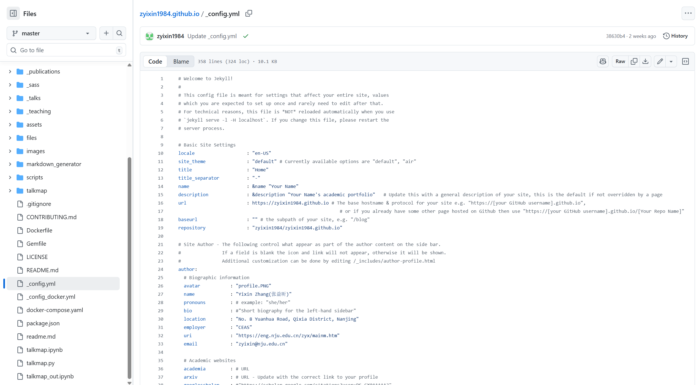
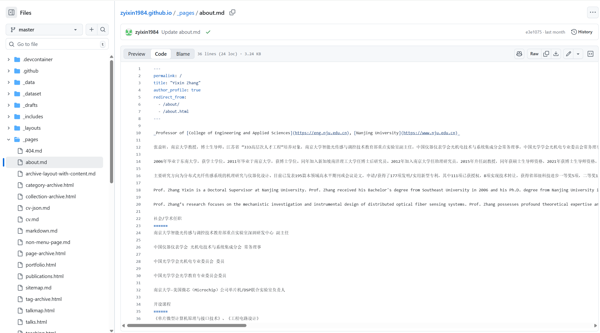
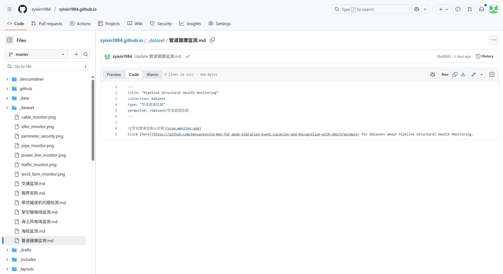

# 站点全局配置

## 简介

描述站点全局配置（Jekyll），说明关键字段、编辑注意事项、隐私与发布流程，以及本地预览与回滚步骤。

## 文件位置

_config.yml



## 全局与元信息

代码位于
```yaml
# Basic Site Settings
locale                   : "en-US"
site_theme               : "default" # Currently available options are "default", "air"
title                    : "Home"
title_separator          : "-"
name                     : &name "Your Name"
description              : &description "Your Name's academic portfolio"   # Update this with a general description of your site, this is the default if not overridden by a page
url                      : https://zyixin1984.github.io # The base hostname & protocol for your site e.g. "https://[your GitHub username].github.io",
baseurl                  : "" # the subpath of your site, e.g. "/blog"
repository               : "zyixin1984/zyixin1984.github.io"
```
- `title`  
  - 类型：字符串  
  - 含义：站点标题（在模板或浏览器 title 中显示）。  
  - 示例：`"Home"`  
  - 注意：影响 SEO 与页面标签显示。

- `url` / `baseurl`  
  - 类型：字符串  
  - 含义：站点根 URL（生产环境）和子路径（若站点托管在子目录）。  
  - 示例：`url: https://zyixin1984.github.io`, `baseurl: ""`

## 作者信息（侧栏）

代码位于
```yaml
author:
  # Biographic information
  avatar           : "profile.PNG"
  name             : "Yixin Zhang(张益昕)"
  pronouns         : # example: "she/her"  
  bio              : #"Short biography for the left-hand sidebar"
  location         : "No. 8 Yuanhua Road, Qixia District, Nanjing"
  employer         : "CEAS"
  uri              : "https://eng.nju.edu.cn/zyx/mainm.htm"
  email            : "zyixin@nju.edu.cn" 
```
- `author`（对象）  
  - 常见子字段及说明：
    - `avatar`：字符串，头像图片路径（存放在`images`文件夹下，务必使用`.png ` 格式）。  
    - `name`：字符串，作者姓名（会在侧栏显示）。  
    - `pronouns`：字符串，可选。  
    - `bio`：字符串，侧栏简短简介。  
    - `location`：字符串，地理位置（注意隐私，示例中有详细地址）。  
    - `employer`：字符串，单位简称或机构。  
    - `uri`：字符串，个人主页或实验室链接（外链）。  
    - `email`：字符串，联系邮箱。  

- 社交 / 学术账号（在 `author` 下）  
  - 字段如 `academia`, `arxiv`, `googlescholar`, `github`, `linkedin`, `twitter` 等。  
  - 含义：放置对应平台完整 URL 或用户名，模板会据此渲染图标与链接。  

## 导航栏集合（Collections）与默认值

代码位于
```yaml
# These settings control the types of collections used by the template
collections:
  teaching:
    output: true
    permalink: /:collection/:path/
  publications:
    output: true
    permalink: /:collection/:path/
  portfolio:
    output: true
    permalink: /:collection/:path/
  dataset:
    output: true
    permalink: /:collection/:path/


# These settings control how pages and collections are included in the site
defaults:
  # _posts
  - scope:
      path: ""
      type: posts
    values:
      layout: single
      author_profile: true
      read_time: true
      comments: true
      share: true
      related: true
  # _pages
  - scope:
      path: ""
      type: pages
    values:
      layout: single
      author_profile: true
  # _teaching
  - scope:
      path: ""
      type: teaching
    values:
      layout: single
      author_profile: true
      share: true
      comments: true
  # _publications
  - scope:
      path: ""
      type: publications
    values:
      layout: single
      author_profile: true
      share: true
      comments: true
  # _portfolio
  - scope:
      path: ""
      type: portfolio
    values:
      layout: single
      author_profile: true
      share: true
      comment: true
  # _talks
  - scope:
      path: ""
      type: dataset
    values:
      layout: talk
      author_profile: true
      share: true
```
- `collections`：定义 `teaching`, `publications`, `portfolio`, `dataset` 等集合以及它们是否输出（`output: true`）和 permalink 规则。  
- `defaults`：针对 `posts`, `pages`, `teaching`, `publications` 等设置默认 `layout`, `author_profile`, `comments`, `share` 等 front matter 值。  
  - 维护：在需要改变站点默认行为时修改此处，而不是单独更改每个页面。

# 首页个人简介

## 文件位置

_pages\about.md



## Front Matter 字段说明

代码位于
```md
---
permalink: /
title: "Yixin Zhang"
author_profile: true
redirect_from: 
  - /about/
  - /about.html
---
```
- `title`: 页面标题（英文姓名），用于页面` <title> `和模板显示。修改会影响 SEO 和导航。示例：`title: "Yixin Zhang"`。
- `permalink`: 访问此页面所需的路径，示例：`/ `表示站点根页。
- `author_profile`: 布尔值，指示模板是否渲染作者档案组件。

## 正文内容结构

- 简介行: 斜体行含职位与学校链接（_Professor of ..._）。
- 中文简介段落: 包含姓名、职称、学术任职、教育与职业经历、创业身份、研究方向、成果统计等。
- 英文简介段落: 与中文段落对应的英文版本。
- 社会/学术任职: 列表形式，若模板把它拆成单独区块，则对应侧栏或详情模块。
- 开设课程: 课程列表，通常渲染为课程信息模块。

# 导航栏页面

## 控制导航栏选项是否显示

### 文件位置

_data\navigation.yml

### 字段解析

- 这是一个以`main`为键的列表，每一项表示导航菜单的一个项目，包括`title`（导航栏显示的文字）和`url`（导航栏指向的链接）。
- 示例代码：
```yaml
main:
  - title: "Publications"
    url: /publications/
  - title: "Datasets"
    url: /dataset/
```
## 配置Dataset页面

代码位于_dataset\管道健康监测.md（以管道健康监测为例）



```md
---
title: "Pipeline Structural Health Monitoring"
collection: dataset
type: "管道健康监测"
permalink: /dataset/管道健康监测
---


Click [here](https://github.com/666yansen/LR-Net-for-Weak-Vibration-Event-Location-and-Recognition-with-DAS/tree/main) for datasets about Pipeline Structural Health Monitoring.
```
要更改这一栏目下使用的图片，请将`_dataset`文件夹下原有的文件`pipe_monitor.png`删除，并将所要显示的新图片文件`pipe_monitor.png` 上传至`_dataset`文件夹下即可。

要新增这一栏目下使用的图片，请将所要新增的图片文件`pipe_monitor_new.png`上传至`_dataset`文件夹下，并在`_dataset\管道健康监测.md`中新增一条语句``即可
要更改或新增此使用场景所对应的数据集，只需更改`[here]`字段后括号内的链接即可。

## 新增导航栏页面

### 目标
- 新增页面 `example`（与 `talks` 结构相同），URL 为 `/example/`（
- 新页面从集合 `site.example` 渲染条目（集合目录为 `_example/`）。

### 1. 在 `_config.yml` 注册新集合（如果尚未存在）
在 `_config.yml` 的 `collections:` 段添加 `example`：
```yaml
collections:
  example:
    output: true
    permalink: /:collection/:path/
```

### 2.在仓库根创建目录`_example/`，并添加 Markdown 条目
```md
---
layout: talk
title: "example1"
permalink: /example/example1/
---

页面正文（Markdown）
```

### 3.复制并修改归档页：创建`_pages/example.html`
把原来的`talks.html`复制为`example.html`，修改 front matter（示例）并把循环改为 `site.example`
```html
---
layout: archive
title: "example"
permalink: /example/
author_profile: true
---



<p style="text-decoration:underline;"><a href="/talkmap.html">See a map of all the places I've given a talk!</a></p>




  

```

### 4.更新导航
编辑`_data/navigation.yml`，添加或修改`example`条目
```yaml
main:
  - title: "Publications"
    url: /publications/

  - title: "Talks"
    url: /talks/

  - title: "example"
    url: /example/

  - title: "Teaching"
    url: /teaching/
  # ...
```
