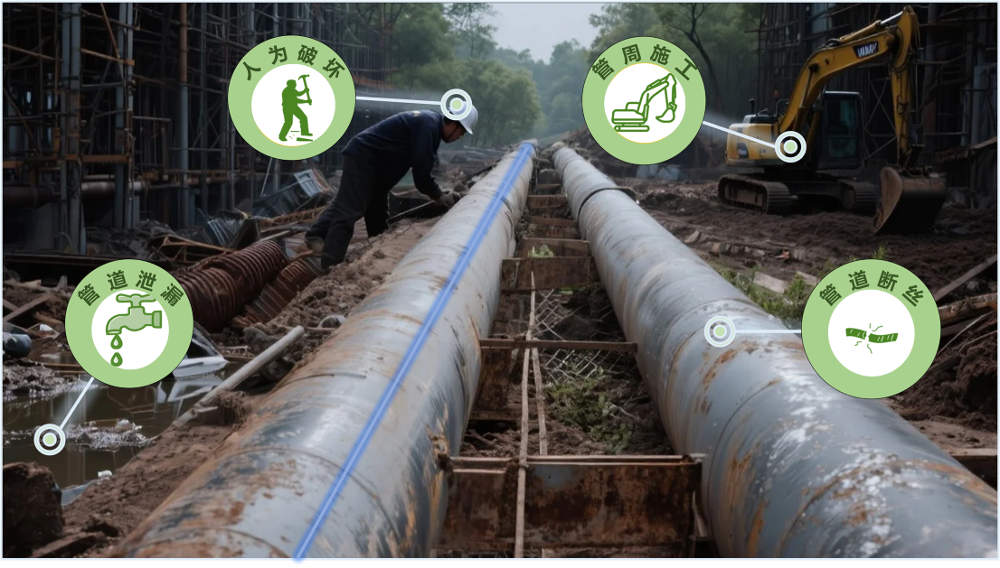

Click [here](https://zyixin1984.github.io/dataset/管道健康监测) for datasets about Pipeline Structural Health Monitoring.

## No.1 LR-Net-for-Weak-Vibration-Event-Location-and-Recognition-with-DAS

This repository hosts a subset of the dataset used in the research paper "LR-Net for Weak Vibration Event Location and Recognition with DAS" (published in IEEE Sensors Journal), along with a link to the full paper. The dataset supports research on weak vibration event localization and recognition based on Distributed Acoustic Sensing (DAS) technology.

Click [here](https://github.com/666yansen/LR-Net-for-Weak-Vibration-Event-Location-and-Recognition-with-DAS/tree/main) for datasets about Pipeline Structural Health Monitoring.
